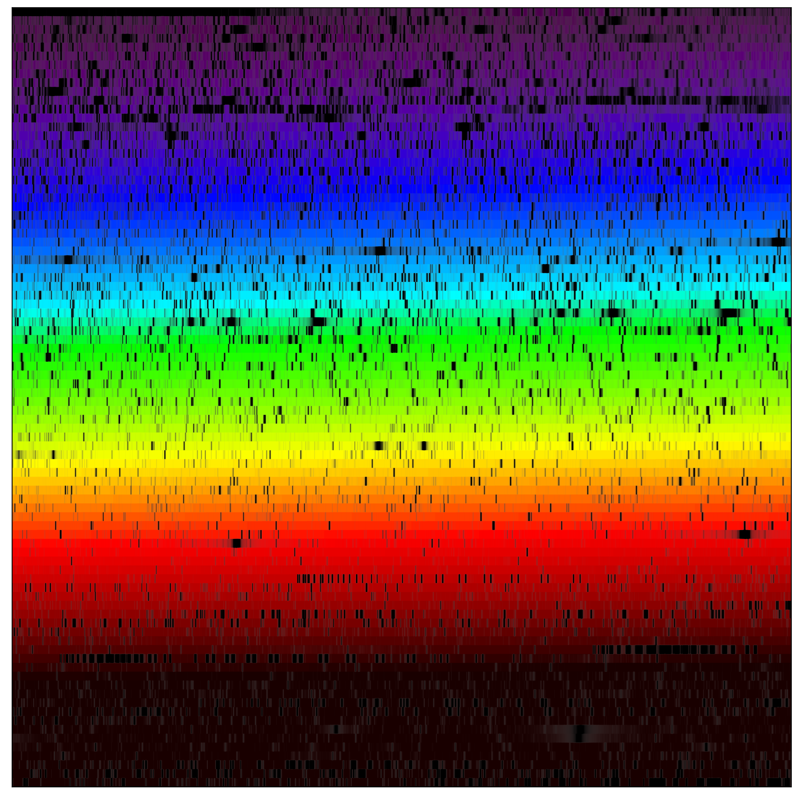

# Summary

`VeloceReduction` is a Python package designed for the reduction of stellar spectra from the IFU fibre-fed [Veloce](https://aat.anu.edu.au/science/instruments/current/veloce/overview) spectrograph [@Case2018] and its Rosso [@Gilbert2018], Verde, and Azzurro [@Taylor2024] detectors. Utilizing both science and calibration images, this package automates the processing of observational data from a given night. It handles data across all 110 echelle orders of the Veloce spectrograph, which covers a spectral range from 390 nm to 940 nm as shown in \autoref{fig:example_spectrum}. The package automatically handles observations via 2 and 4 Amplifier readout (2Amp and 4Amp).

{ width=50% }

# Statement of need

`VeloceReduction` is designed to meet a critical need within the astronomical community for automatic, efficient, versatile, and reliable reduction of spectra obtained from the [Veloce](https://aat.anu.edu.au/science/instruments/current/veloce/overview) spectrograph. This software automates the reduction process, enabling astronomers to quickly assess the quality of spectra across the wavelength range from 390 to 940 nm. Such capabilities are indispensable for large observational programs that are operated with the spectrograph and demand rapid feedback on spectral quality to adjust observing strategies in real-time.

The primary goal of these programs is to advance our understanding of elemental abundances in stars, covering up to 38 different elements and some isotope ratios. Accurate and detailed elemental abundance measurements can reveal significant insights into the processes that govern stellar evolution and the chemical enrichment of stars and galaxies [@McKenzie2024]. These measurements are crucial for probing stellar nucleosynthesis processes and for investigating the origin of elements, a cornerstone of astrophysical research.

# Acknowledgements

We acknowledge contributions from Chris Tinney, namely the information on overscan regions, initial tramlines of orders across the spectrograph and the cartographing of ThXe arc lines across these orders.

# References
